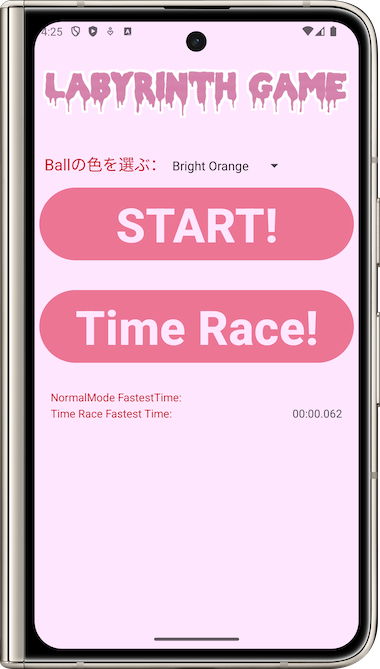
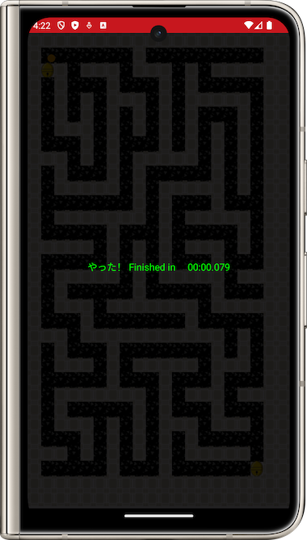
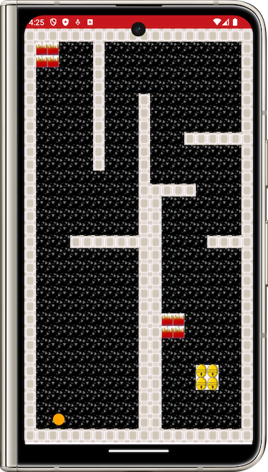
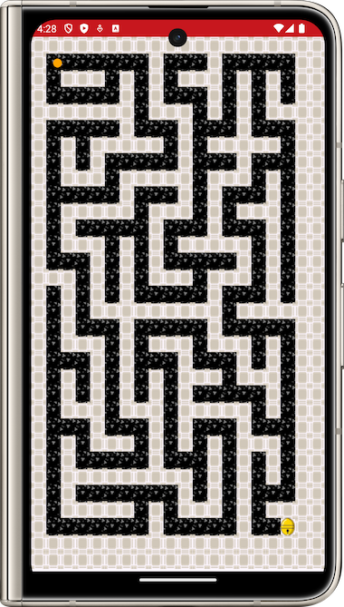

# SensorGame

| 主画面 | クリア画面 |
|--------|-----------|
|  |  |

| 普通モード | ランダム生成迷路モード |
|------------------------|------------|
|  |  |

<!---->
<!---->
<!---->
<!---->

## 概要

これはセンサーを使用したボールゲームです。スマートフォンの動作センサーを使ってボールを操作し、障害物を避けながら迷路を通過し、ベルの位置に到達することでゲームのステージをクリアします。

ゲームには、通常モードとランダム生成迷路モードの二つのモードがあります。ゲームの進行状況は記録され、主画面で最速クリア時間が表示されます。
