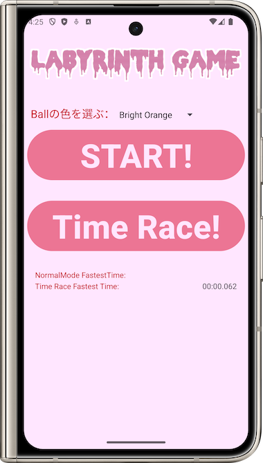
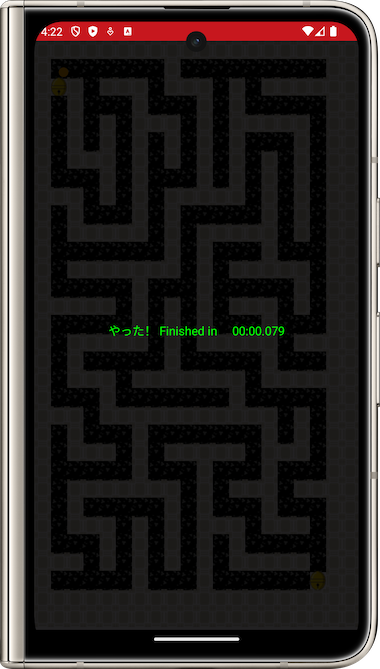
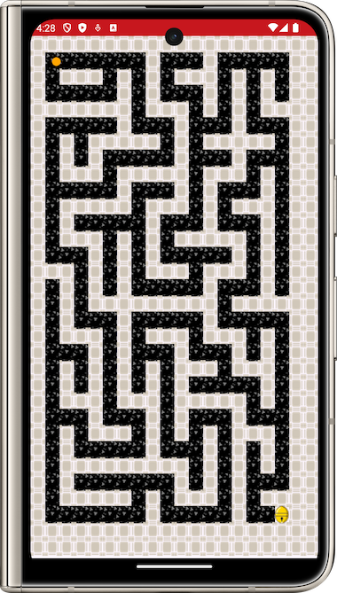

# SensorGame

- [English](README_en.md)
- [日本語](README.md)

| 主界面 | 通关界面 |
|--------|-----------|
|  |  |

| 普通模式 | 随机模式 |
|------------------------|------------|
|  |  |

## 简介

这是一个使用传感器的小球游戏。通过手机的动作传感器操作小球，躲避障碍物并通过迷宫，到达铃铛处来完成游戏关卡。游戏有普通和随机生成迷宫两种模式，会记录游戏时间并在主界面显示最快通过纪录。
开始游戏前可以选择小球的颜色，选择游戏模式后将播放背景音乐。
